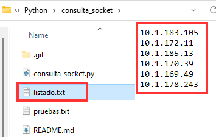
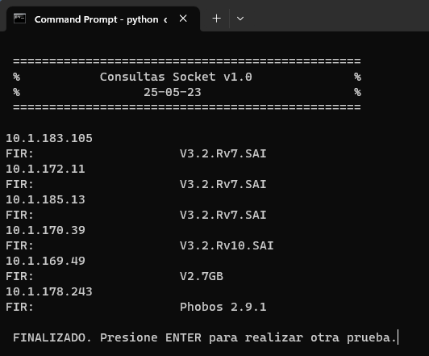
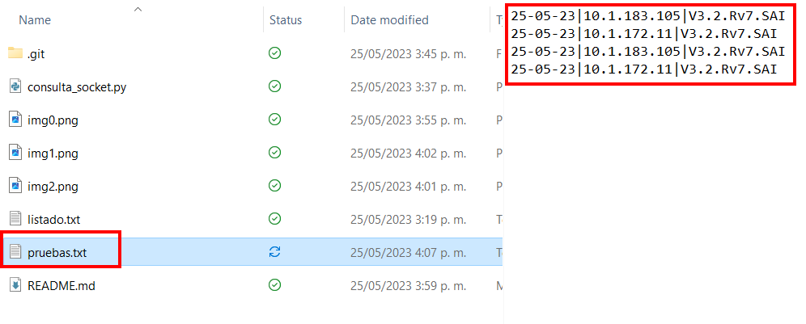

# 🐍Consultas a través de Socket en Python🐍

***
## Descripción
Esta aplicación permite realizar consultas a un listado de IPs determinadas, en este caso se envía el comando "FIR" a unos equipos de comunicacion determinados, con el fin de consultar su version de firmware de forma remota.

***
## Procedimiento
1. Debe ubicarse la carpeta donde esté almacenada la app `consulta_socket.py` e ingresar el listado de IPs a consultar en el archivo `listado.txt`:  

2. Ejecutar la app `consulta_socket.py` desde la linea de comandos:  

3. Se iniciará la consulta automatica de cada una de las IPs :  

4. Se creará de forma automatica el archivo `pruebas.txt` donde se almacenarán los resultados acompañados de la fecha en que se realizó la consulta:  
